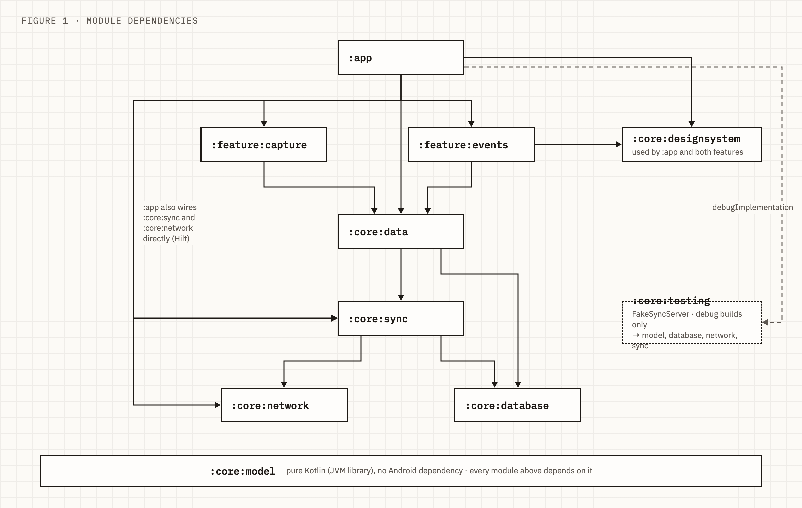
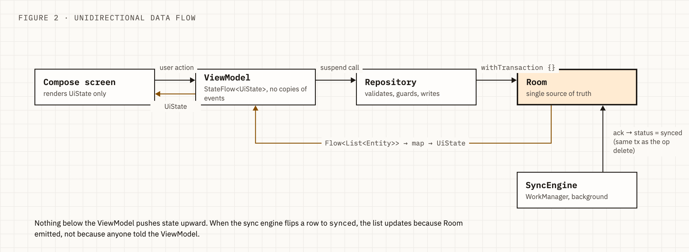
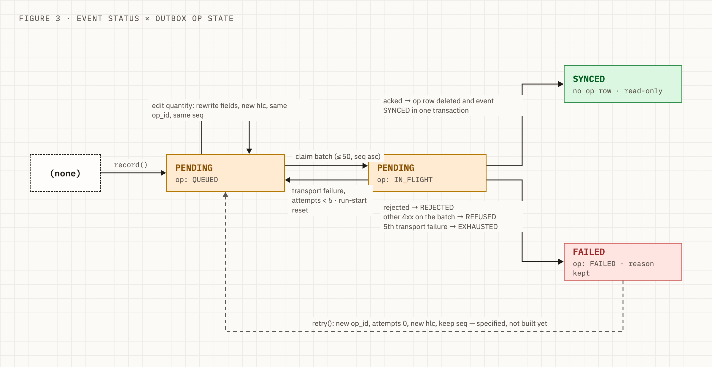
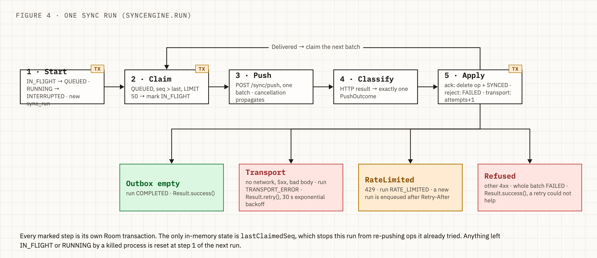

# picktrace-challenge

An offline-first Android app for recording field events (a worker handled a quantity at a block)
with no connectivity, and pushing them to a backend once the network comes back.

The interesting part is not the three screens. It is the guarantee behind them: an event that was
saved is never lost, never sent twice, and never shown in a state the database doesn't back.
This document explains how that guarantee is built. The full design lives in
[`specs/001-field-event-sync/`](specs/001-field-event-sync/) (spec, plan, data model, contracts).

## The approach in one paragraph

Every write goes to Room first, and the UI only ever renders Room `Flow`s. Saving an event inserts
two rows in one transaction: the `field_event` itself and a `pending_op` outbox row that says
"CREATE this entity with these fields". A WorkManager job drains the outbox in insertion order, in
batches of 50, to `POST /sync/push`. The outbox row is deleted only when the server acks it, in the
same transaction that flips the event to `synced`. Nothing about sync lives in memory: the outbox,
attempt counters, the in-flight marker, the logical clock and the run log are all Room tables, and
scheduling belongs to WorkManager. A process kill at any instant leaves a state the next run can
resume from.

## Module layout



| Module | Owns |
|---|---|
| `:core:model` | Pure Kotlin. `FieldEvent`, `SyncStatus`, `WorkerId`/`BlockId` value classes, the validator, a hand-rolled RFC 9562 UUIDv7 generator, and the pure `Hlc` tick logic. No Android dependency. |
| `:core:database` | Room `PicktraceDatabase` (schema v1 exported to `core/database/schemas/`): `field_event`, `pending_op`, `sync_state`, `sync_run`, and their DAOs. |
| `:core:network` | Retrofit `SyncApi` and the DTOs for push, pull and snapshot. `fields` travels as an opaque `JsonObject`; the network layer knows nothing about `FieldEvent`. |
| `:core:sync` | `SyncEngine`, `PushOutcomeClassifier`, `FieldEventCodec` (the typed codec for `fields`), Room-backed `HlcClock`, `SyncWorker`, `WorkManagerSyncScheduler`, `ForegroundConnectivityTrigger`. |
| `:core:data` | `FieldEventRepository`: the only place that writes `field_event` and `pending_op`, and the place that enforces the read-only rules. |
| `:core:designsystem` | Material 3 theme, `StatusChip`, icons. |
| `:core:testing` | `FakeSyncServer`, test databases, dispatcher rule, fixtures. Shipped into debug builds so the app runs without a backend. |
| `:feature:capture` | The record-an-event form. |
| `:feature:events` | List with status filter, detail with failure reason and attempt count, edit and delete. |
| `:app` | `PicktraceApplication` (Hilt + `HiltWorkerFactory`), `MainActivity` with the type-safe `NavHost`, base URL from `BuildConfig`, and the debug-only module that installs `FakeSyncServer` as an OkHttp interceptor. |

`:core:model` is a JVM library, not an Android one, so the domain types and the id/clock logic are
testable with plain JUnit and can't accidentally reach for a `Context`.

Build logic is convention plugins in `build-logic/` (application, library, feature, compose, room,
hilt, jvm-library, test) over a version catalog in `gradle/libs.versions.toml`. Annotation
processing is KSP only; there is no kapt anywhere.

## Layers and data flow

Clean Architecture with MVVM on top, unidirectional:



ViewModels expose an immutable `UiState` as a `StateFlow` built from repository `Flow`s. They
never hold a copy of an event; when sync flips a row to `synced`, the list updates because Room
emitted, not because anyone told the ViewModel. Sync progress follows the same rule: the engine
writes a `sync_run` row per run (kept to the last 20), so the progress banner, when it lands, will
observe that table rather than an in-memory event bus.

## The outbox

`pending_op` is the FIFO queue:

| Column | Why it exists |
|---|---|
| `seq` (AUTOINCREMENT PK) | Delivery order. Never reused, so an edit or a retry keeps its place in the queue. |
| `op_id` (UUIDv7, unique) | Idempotency key for the server. |
| `entity_type`, `entity_id` (unique together) | One op per entity in v1. There is no foreign key on purpose: the outbox stays entity-agnostic, and the pairing is enforced by the repository's transactions. |
| `op_type`, `schema_version` | `CREATE` and `1` today. Present so the server can evolve without a client redeploy. |
| `hlc` | Hybrid logical clock stamp, monotonic across process death and wall-clock jumps. |
| `fields_json` | Exactly the bytes that will be sent. |
| `state` | `QUEUED`, `IN_FLIGHT` or `FAILED`. |
| `attempts`, `failure_kind`, `last_error` | What the detail screen shows for a failed event. |

Ids come from the client. `Uuid7` is written by hand (50 lines) rather than pulled from a
library because the requirement is specific: version and variant bits per RFC 9562, and monotonic
within the same millisecond so `ORDER BY id` and `ORDER BY seq` agree. `Uuid7Test` generates 10,000
ids in one millisecond and asserts strict ordering.

The HLC is Room-backed. `HlcClock.tick()` reads and writes the `sync_state` row inside the caller's
transaction, so the clock advance and the op it stamps commit together. If the device's wall clock
moves backwards, the counter keeps the stamp increasing.

## Event status × op state



The user-facing status is derived: `pending` means an op row exists and isn't failed, `synced`
means the op row is gone, `failed` means the op row is kept with a reason. The status column on
`field_event` is written in the same transaction as the op change so the two can't disagree.

Two rules the repository enforces inside the transaction, not before it:

- A `synced` event is read-only. There is no UPDATE or DELETE op in v1, so a local edit would be
  a silent divergence from the server.
- An `IN_FLIGHT` event refuses edits and deletes. The guard runs inside the same transaction as
  the write, so a sync run claiming the batch can't slip in between the check and the update.

Editing a pending event rewrites the CREATE op's `fields_json` in place and stamps a new HLC. It
keeps the same `op_id`. That is a deliberate choice from the setup interview and it carries a known
risk: if an earlier attempt of that op reached the server and only the response was lost, an
idempotent server will ack the old fields. It is logged as Open Question 1 in the plan for the
backend owner; the alternative (a new `op_id` per edit) trades it for a duplicate-entity question
the contract also doesn't answer yet.

## The sync run



`SyncEngine.run()` is a loop of small transactions:

1. **Start.** Reset any `IN_FLIGHT` ops to `QUEUED` and mark any `RUNNING` run as `INTERRUPTED`.
   These are the leftovers of a process that died mid-run. Insert a new `sync_run` row.
2. **Claim.** `SELECT ... WHERE state = QUEUED AND seq > ? ORDER BY seq LIMIT 50`, mark the rows
   `IN_FLIGHT`, commit. The `seq > lastClaimedSeq` cursor is the only in-memory state, and it only
   prevents this run from re-pushing ops it already tried.
3. **Push.** One HTTP call. `CancellationException` is rethrown, not swallowed, so a cancelled
   worker leaves the batch `IN_FLIGHT` for step 1 of the next run to reset.
4. **Classify.** `PushOutcomeClassifier` maps the HTTP result to exactly one of:
   - `Delivered(acked, rejected, missing)` for a parseable 2xx. Ops in neither list are `missing`
     and are treated as a transport failure for that op.
   - `Transport` for no network, 5xx, empty or unparseable body.
   - `RateLimited(retryAfter)` for 429, parsing both delta-seconds and HTTP-date forms.
   - `Refused(code)` for any other 4xx: the whole batch fails permanently.
5. **Apply.** One transaction: delete acked ops and mark their events `SYNCED`; mark rejected ops
   `FAILED` with the server's reason; on transport failure increment `attempts` and put the ops
   back to `QUEUED`, or `FAILED (EXHAUSTED)` once they hit 5; update the run's counters.
6. **Loop** on `Delivered`, stop on anything else. The run outcome tells `SyncWorker` what to do:
   `Retry` uses WorkManager's exponential backoff, `RetryAfter` enqueues a delayed run because
   `Result.retry()` can't carry a server-specified delay, and `Refused` returns success because
   retrying the same batch can't help.

The outbox is never loaded whole. Every query has a `LIMIT`, so 5,000 events after a multi-day
outage cost the same memory as 50.

## Scheduling and triggers

`WorkManagerSyncScheduler.requestSync()` enqueues unique work named `field-event-sync` with
`NetworkType.CONNECTED` and `ExistingWorkPolicy.APPEND_OR_REPLACE`. That policy is what makes
"only one run at a time" and "a trigger during a run means run again after" the same line of code:
a second request while a run is active appends one more run behind it instead of starting a
parallel one or being dropped.

Triggers:

- The repository calls `requestSync()` after a record or retry transaction commits, never inside
  it. A scheduling failure can't tear the local write.
- `ForegroundConnectivityTrigger` registers a `ConnectivityManager` default-network callback while
  `MainActivity` is started and requests an expedited run on `onAvailable`. Below API 31, expedited
  work runs as a foreground service, hence `SyncWorker.getForegroundInfo()`.
- In the background, the `CONNECTED` constraint on every enqueued request is the trigger.
- `SyncTrigger` is the seam for Firebase Cloud Messaging later; nothing else needs to change.

## Testing against a server that doesn't exist

The backend isn't built yet. Instead of mocking `SyncApi` per test, `:core:testing` ships
`FakeSyncServer`: an OkHttp application `Interceptor` that implements the whole contract in memory,
including pull cursors and `410 Gone`. Requests go through the real Retrofit and kotlinx.serialization
stack and get answered before they reach a socket. Tests script it with faults (`DropConnection`,
`DropAfterProcessing`, `Status(503)`, `Status(429, retryAfter)`, `GarbageBody`, `PartialBody`) and
reject rules, then inspect `deliveryLog`, `pushes` and `storedEntity()`.

Debug builds install the same fake through a Hilt multibinding, with one rule so the failure path
can be exercised by hand: any quantity of 1000 or more is rejected. Release builds contribute no
interceptor and use `SYNC_BASE_URL` from the `picktrace.syncBaseUrl` Gradle property.

All tests run on the JVM under Robolectric, including Room, WorkManager (`TestDriver`) and Compose
UI tests. There is no `androidTest` source set. The tests that matter most:

| Test | What it proves |
|---|---|
| `RecordAtomicityTest` | A failure injected after the entity insert leaves neither the event nor the op. |
| `RelaunchPersistenceTest` | Close the file-backed DB, reopen it, events are identical. |
| `SyncEngineOrderTest` | Delivery follows `seq`, even with skewed event timestamps. |
| `SyncEngineBatchTest` | 250 events become 5 pushes of 50; rejects are per op; a failed batch stays pending. |
| `SyncEngineTransportTest` | Connection drop mid-run: earlier batches synced, the rest pending, none failed. Five 503s exhaust an op. 429 honours `Retry-After`. |
| `SyncEngineRelaunchTest` | Server processes a batch but the response is lost; a new engine on the same DB file re-pushes and the server stored each entity once. |
| `SyncSchedulerTest` | Overlapping requests never deliver an `op_id` twice. |
| `ReadOnlyRulesTest` | Edit/delete of a synced or in-flight event is refused and the DB is unchanged. |

## Building and running

Requires JDK 17. Versions were looked up on 2026-09-25 (Kotlin 2.4.20, AGP 9.4.1, Compose BOM
2026.09.00, Room 2.8.5, Hilt 2.60.1, WorkManager 2.12.0, Retrofit 3.0.0); see
`gradle/libs.versions.toml` for the coupling notes.

```bash
./gradlew test                  # every module, on the JVM
./gradlew :app:installDebug     # debug build with FakeSyncServer
adb shell am start -n com.jcgrdev.picktracechallenge/.MainActivity
```

To see the offline path: `adb shell cmd connectivity airplane-mode enable`, record a few events,
force-stop the app, relaunch, and they're listed as pending. Disable airplane mode and the
foreground trigger syncs them within seconds. Record one with quantity 1000 to see a rejection.

## Status and what's deliberately not here

Built: the whole data and sync layer, the capture screen, the list and detail screens with edit
and delete. Not yet built: manual retry from the detail screen (the `retry()` transaction is
specified in the data model but the repository doesn't expose it yet), the sync progress banner
over `sync_run`, and the 5,000-event backlog test.

Deferred by design, with the seams in place:

- **Pull and snapshot.** The DTOs and `FakeSyncServer` support exist; the engine is push-only.
  When pull lands, the pulled page and its cursor are saved in one transaction, and rows with
  pending local ops are never overwritten.
- **UPDATE and DELETE ops.** Edits before sync rewrite the CREATE in place; synced events are
  read-only until the server contract for updates is agreed.
- **FCM.** Behind `SyncTrigger`.
- **Worker and block master data.** Ids are opaque strings the user types.

The project is developed in approved phases with Spec Kit. `specs/001-field-event-sync/tasks.md`
is the task list; `interview-session.md` is the transcript of the setup decisions that `CLAUDE.md`
summarises.
