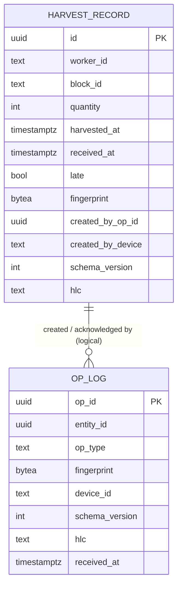

# Data Model: Harvest Sync Backend POC

**Date**: 2026-09-25 | **Source**: spec Section 5, refined for implementation.
Logical description only; the migration file written in phase B1 is the executable form.

## Tables

### `harvest_record`

One row per harvest record. Immutable in the POC.

| Column | Type | Nullable | Constraint | Notes |
|--------|------|----------|------------|-------|
| `id` | uuid | no | primary key | Client UUIDv7. The unique index is the "stored exactly once" guarantee. |
| `worker_id` | text | no | length 1..128 (check) | Opaque. Byte-exact as sent. |
| `block_id` | text | no | length 1..128 (check) | Opaque. Byte-exact as sent. |
| `quantity` | integer | no | > 0 (check) | Upper bound is validated in the application because it is configurable. |
| `harvested_at` | timestamptz | no | | Device-reported instant, millisecond precision. |
| `received_at` | timestamptz | no | | Server clock, captured once per request before the transaction. |
| `late` | boolean | no | | `received_at - harvested_at > sync window` at insert time. Never updated. |
| `fingerprint` | bytea | no | length 32 (check) | SHA-256 of the canonical form (`contracts/canonical-form.md`). |
| `created_by_op_id` | uuid | no | | The op that first stored the row. Audit only, no foreign key. |
| `created_by_device` | text | no | | `X-Device-Id` header. Audit. |
| `schema_version` | integer | no | | From the op envelope. |
| `hlc` | text | no | | From the op envelope. |

Indexes:

| Name | Columns | Kind | Purpose |
|------|---------|------|---------|
| `harvest_record_pkey` | `id` | unique | Duplicate resolution under concurrency. |
| `harvest_record_harvested_at_idx` | `harvested_at` | btree | Day totals and late-window queries (v1 reporting; cheap now). |

### `op_log`

One row per **acknowledged** op. Rejections are never written.

| Column | Type | Nullable | Constraint | Notes |
|--------|------|----------|------------|-------|
| `op_id` | uuid | no | primary key | Client UUIDv7. Idempotency key. |
| `entity_id` | uuid | no | | Logical reference to `harvest_record.id`. **No foreign key** (spec Section 5); integrity is guaranteed by the transaction and asserted by tests. |
| `op_type` | text | no | value `CREATE` (check) | Widened to UPDATE/DELETE in v1 by relaxing the check. |
| `fingerprint` | bytea | no | length 32 (check) | Canonical-form hash of the op. Equal to the record fingerprint for CREATE. |
| `device_id` | text | no | | Header. Audit. |
| `schema_version` | integer | no | | Envelope metadata. |
| `hlc` | text | no | | Envelope metadata. |
| `received_at` | timestamptz | no | | Same request timestamp as the record it created. |

Indexes:

| Name | Columns | Kind | Purpose |
|------|---------|------|---------|
| `op_log_pkey` | `op_id` | unique | Duplicate resolution under concurrency. |
| `op_log_entity_id_idx` | `entity_id` | btree | All ops for a record (audit; edit history in v1). |

## Relationships

A record has at least one op row (the creating one) and gains one more for every distinct opId
that re-created it with identical content (spec decision 6). An op row always points at an
existing record because both are written in one transaction and the pass-3 compensating delete
removes a record whose only op turned out to be a mismatch.

## Invariants (asserted by tests, not by constraints)

| # | Invariant | Where checked |
|---|-----------|---------------|
| I1 | Every `op_log.entity_id` exists in `harvest_record.id`. | Load-test invariant checker, race tests. |
| I2 | Every `harvest_record.id` has at least one `op_log` row. | Same. |
| I3 | For every `op_log` row, `fingerprint` equals the referenced record's `fingerprint`. | Same (true for CREATE only; v1 relaxes). |
| I4 | Set of `harvest_record.id` equals the set of distinct valid record ids the load generator sent. | Load-test invariant checker. |
| I5 | Every acked opId in a recorded response has an `op_log` row; every rejected opId has none. | Load-test invariant checker. |

## In-memory model (per request, never persisted)

| Type | Fields | Purpose |
|------|--------|---------|
| `IncomingOp` | request index, `opId`, `entityType`, `entityId`, `opType`, `schemaVersion`, `hlc`, `fields` | Parsed envelope, one per array element including duplicates. |
| `PlannedOp` | `IncomingOp` + canonical string + fingerprint + first-occurrence index | Output of duplicate collapse; one per distinct opId that survived. |
| `Outcome` | `opId`, `ACK` or `REJECTED(reason, detail?)`, first-occurrence index | Union of pre-transaction rejections and committed results; sorted by index for the response. |
| `WorkList` | planned ops sorted by (`entityId`, `opId`) | Row order supplied to each pass. |
| `RequestClock` | one `received_at` instant | Captured before the transaction so every row in a batch shares it and the late flag is computed once. |

## Migration plan

| Version | Content | Test |
|---------|---------|------|
| V1 | Both tables, both primary keys, the two secondary indexes, the check constraints above. | `SchemaTest` asserts the two unique indexes exist by name and that inserting a duplicate key in each table fails; asserts `synchronous_commit`, `fsync` and `full_page_writes` report `on` on the test database. |

## Configuration values referenced by the model

See `contracts/configuration.md` for names and defaults: `maxQuantity`, `futureTolerance`,
`syncWindow`, `maxBatchSize`, `maxBodyBytes`, pool size, pool timeout, request timeout,
deadlock retry count and delay.
