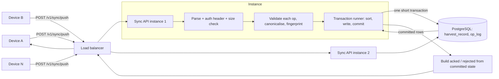

# Backend Design: Harvest Sync POC

**Feature directory**: `specs/002-harvest-sync-backend`
**Created**: 2026-09-25
**Status**: Draft for review
**Companion**: client feature spec `specs/001-field-event-sync/spec.md`; client contract in `CLAUDE.md`

This document describes the design only. It contains no source code, SQL, or framework
configuration. Every decision carries a justification. Items marked **Assumption** were not
given and can be changed without affecting the rest of the design unless noted.

---

## 1. Summary

Field workers record harvests on an offline-first Android app. The app queues each record as an
operation ("op") and pushes queued ops in batches when it has connectivity. Because responses get
lost, apps crash mid-sync, and devices retry blindly, the same batch reaches the server more than
once. Hundreds of devices come online together at shift start, so those duplicates arrive
concurrently, across more than one server instance.

The POC must prove one property: **every record a device sends is stored exactly once, and the
server never acknowledges a record it has not durably stored**, under concurrent load.

The approach is deliberately small. A single endpoint accepts a batch of CREATE ops. Each op is
reduced to a fingerprint of its canonical content. Two PostgreSQL tables, one for records and one
for the op log, carry unique keys on record id and op id. All writes for a batch happen in one
short transaction; the acknowledgement is built from what that transaction committed, never from
what the application intended to write. Duplicates are not detected by the application; they are
detected by the database's unique indexes, which is the only place a race between two requests can
be decided correctly. Overlapping batches are processed in a consistent key order so they cannot
deadlock, and a bounded retry covers the residual cases because processing is idempotent.

Everything else (edits, voids, pulls, real authentication, retention) is left for v1. The contract
is chosen so none of it requires a breaking change.

---

## 2. Goals and non-goals

### Goals (what the POC proves)

| # | Goal | How it is verified |
|---|------|--------------------|
| G1 | A record is stored at most once, whatever the number of times and the concurrency with which it is sent. | Race and load tests, invariant "no record id appears twice". |
| G2 | An op is acknowledged only after the transaction that stored its record has committed. | Crash-injection tests, invariant "every acked op has a stored record". |
| G3 | Every record sent by a device ends up stored, unless it is rejected with a reason the device can act on. | Load test, invariant "stored records = distinct valid ids sent". |
| G4 | The same op id with different content is never acknowledged. | Correctness tests for `OP_CONTENT_MISMATCH`. |
| G5 | A bad record never prevents the rest of its batch from being stored. | Mixed-batch test. |
| G6 | Two server instances behind one database behave as one. | Load test runs with two instances. |
| G7 | Under overload the server answers fast with "busy, retry later" instead of queueing requests until they time out. | Load test with the pool deliberately undersized. |

### Non-goals (deliberately left out)

- Update, delete or void ops. Only CREATE.
- Pull, snapshot, cursors, tombstones. The client contract defines them; the POC does not implement them.
- Real authentication and authorisation. A device id header stands in.
- Worker and block master data validation. Ids are opaque non-empty strings.
- Op log retention, archival, back-office endpoints, reporting.
- High availability of PostgreSQL itself (replication, failover, backups).
- Throughput beyond "hundreds of devices at shift start".

---

## 3. Architecture overview

### Components

| Component | Responsibility | Justification |
|-----------|----------------|---------------|
| Mobile app (existing) | Keeps an outbox in Room, pushes batches oldest first, retries with backoff, treats per-op rejections as permanent and whole-batch retryable errors as "try again later". | Already specified in `specs/001-field-event-sync`; the backend must fit it, not the reverse. |
| Load balancer | Round-robins to N stateless server instances. | Lets G6 be tested with two instances without any coordination logic. |
| Sync API (Kotlin + Ktor) | Parses, authenticates by header, validates, canonicalises, runs the batch transaction, builds the response. Holds no state between requests. | Statelessness is what makes horizontal scaling free and makes "coordination through the database" the only coordination. |
| Transaction runner | Owns the connection pool, the retry loop for deadlocks, the transaction boundary, and the "ack only from committed rows" rule. | Isolating this logic makes it testable in one place and keeps external calls out of transactions by construction. |
| PostgreSQL | Single source of truth. Unique indexes decide every duplicate race. WAL guarantees durability of anything acknowledged. | The only component whose correctness under concurrency is proven, so all correctness is delegated to it. |

### Request flow



Nothing sits between the API and the database. There is no cache, no queue, no in-memory dedup
set. **Justification**: each of those would be a second place where the answer to "have I seen
this op?" could live, and two places can disagree. One place cannot.

---

## 4. API contract

### Endpoint

| Item | Value | Justification |
|------|-------|---------------|
| Method and path | `POST /v1/sync/push` | The client already sends `POST /sync/push` relative to its base URL; the base URL carries `/v1`. No client change. |
| Identity header | `X-Device-Id: <opaque string>` (required) | Fake auth for the POC. Stored for audit, not used for idempotency. |
| Content type | JSON | Client uses kotlinx.serialization JSON. |
| Batch limit | 500 ops | Given. The client sends 50 by default, so the server limit is a safety cap, not the working size. |
| Max body size | 2 MB (**Assumption**) | 500 ops of the record shape below are well under 1 MB; the cap stops abuse before parsing. |

### Request body

The body is an object with one field, `ops`, an array of op envelopes. The envelope is the one
the client already agreed on.

| Field | Type | Required | Meaning |
|-------|------|----------|---------|
| `opId` | UUID string | yes | Client-generated (UUIDv7). Idempotency key for the op. |
| `entityType` | `FIELD_EVENT` | yes | Only value in the POC. Other values are rejected per op. |
| `entityId` | UUID string | yes | Client-generated record id. Must equal `fields.id` if the client sends one; the POC treats `entityId` as the record id. |
| `opType` | `CREATE` | yes | Only value in the POC. Other values are rejected per op. |
| `schemaVersion` | integer | yes | Stored as metadata. Not part of the fingerprint. |
| `hlc` | string | yes | Client hybrid logical clock. Stored as metadata. Not part of the fingerprint. |
| `baseVersion` | integer or absent | no | Always absent for CREATE. Ignored in the POC. |
| `fields` | object | yes for CREATE | The record: `workerId` (string), `blockId` (string), `quantity` (integer), `timestamp` (ISO-8601 UTC instant). |

Example request (two ops, one of them a retry of an earlier one):

```
X-Device-Id: tablet-0042

{
  "ops": [
    {
      "opId": "01924b1e-3a2c-7d10-9f3e-0a1b2c3d4e5f",
      "entityType": "FIELD_EVENT",
      "entityId": "01924b1e-3a2c-7d10-9f3e-aaaaaaaaaaaa",
      "opType": "CREATE",
      "schemaVersion": 1,
      "hlc": "0000001758800000000-0001-node7",
      "fields": { "workerId": "W-17", "blockId": "B-3", "quantity": 12,
                  "timestamp": "2026-09-25T06:40:12Z" }
    },
    {
      "opId": "01924b1e-3a2c-7d10-9f3e-0a1b2c3d4e60",
      "entityType": "FIELD_EVENT",
      "entityId": "01924b1e-3a2c-7d10-9f3e-bbbbbbbbbbbb",
      "opType": "CREATE",
      "schemaVersion": 1,
      "hlc": "0000001758800001000-0001-node7",
      "fields": { "workerId": "W-17", "blockId": "B-3", "quantity": 0,
                  "timestamp": "2026-09-25T06:41:00Z" }
    }
  ]
}
```

### Response body (HTTP 200)

| Field | Type | Meaning |
|-------|------|---------|
| `acked` | array of opId | Ops whose record is durably stored (now or earlier). |
| `rejected` | array of `{ opId, reason, detail?, serverVersion? }` | Ops that were not stored, each with a reason code. `detail` is a short human-readable string naming the offending field. `serverVersion` is reserved for v1 and absent in the POC. |

Rules:

- Every distinct `opId` in the request appears exactly once, in exactly one list, in request
  order of first occurrence. **Justification**: the client marks outbox rows by opId; a missing or
  doubled opId would leave a row in limbo.
- HTTP 200 is returned even when every op is rejected. The batch itself was fine.
- The client must ignore unknown response fields (`detail` is new relative to `CLAUDE.md`; see
  Open Questions).

Example response for the request above:

```
{
  "acked": ["01924b1e-3a2c-7d10-9f3e-0a1b2c3d4e5f"],
  "rejected": [
    { "opId": "01924b1e-3a2c-7d10-9f3e-0a1b2c3d4e60",
      "reason": "INVALID_RECORD",
      "detail": "quantity must be a whole number greater than 0" }
  ]
}
```

### Per-op rejection reasons

| Reason | When | Permanent? | Expected client reaction |
|--------|------|------------|--------------------------|
| `INVALID_RECORD` | A field fails validation (Section 4, Validation). `detail` names the field. | Yes | Mark the event `failed` with the detail. User may edit and retry, which issues a new opId. |
| `OP_CONTENT_MISMATCH` | This opId was stored earlier with different content, or appears twice in this request with different content. | Yes | Mark `failed`. This indicates a client bug or tampering; the user must re-record. Never silently re-send with a new opId. |
| `ID_CONFLICT` | A record with this id already exists with different content, under a different opId. | Yes | Mark `failed`. Same as above: the device's copy disagrees with the stored one. |
| `UNSUPPORTED_OP_KIND` | `opType` is not `CREATE` or `entityType` is not `FIELD_EVENT`. | Yes | Mark `failed`. Should not happen with the v1 client. |

**Justification for making every rejection permanent**: the client contract already says
"rejected = failed, retry issues a new op". Any reason that could clear on its own (temporary
overload, database down) is therefore expressed as a whole-batch retryable error, never as a
per-op rejection.

### Whole-batch errors

| HTTP | Error code | When | Retryable? | Expected client reaction |
|------|------------|------|------------|--------------------------|
| 400 | `MALFORMED_REQUEST` | Body is not valid JSON, `ops` missing or not an array, or an op is missing a required envelope field so badly that it has no usable `opId`. | No | Log, keep ops pending, stop the run. This is a client bug; the outbox is left intact for a fixed client. |
| 401 | `MISSING_DEVICE_ID` | `X-Device-Id` absent or empty. | No | Stop syncing, surface a configuration error. Do not retry until the header is present. |
| 413 | `BATCH_TOO_LARGE` | More than 500 ops or body over the size cap. | No | Client bug. Keep pending, stop the run. |
| 415 | `UNSUPPORTED_MEDIA_TYPE` | Content type is not JSON. | No | Client bug. Keep pending. |
| 429 | `BUSY` | Connection pool could not be acquired within its timeout. `Retry-After` header present. | Yes | Keep pending, increment the attempt counter, wait at least `Retry-After` plus jitter, then retry. |
| 503 | `DATABASE_UNAVAILABLE` | Database unreachable or the deadlock retry budget was exhausted. `Retry-After` present. | Yes | Same as 429. |
| 500 | `INTERNAL` | Unexpected failure. | Yes | Same as 429, with the client's default backoff. |

A whole-batch error means **nothing in the batch was stored** (for 4xx) or **nothing is known
to be stored** (for 5xx, where the transaction may or may not have committed before the failure;
Section 9). In both cases the client retries the same ops with the same opIds, and idempotency
resolves the outcome.

### Validation (per op, before the transaction)

| Field | Rule | Reason on failure |
|-------|------|-------------------|
| `opId`, `entityId` | Well-formed UUID. | `INVALID_RECORD` with detail naming the field. (An op with an unparseable `opId` cannot be reported per op and becomes `MALFORMED_REQUEST`.) |
| `workerId`, `blockId` | Present, non-empty after no trimming, at most 128 characters (**Assumption** on the length). | `INVALID_RECORD` |
| `quantity` | Integer, greater than 0, at most `maxQuantity` (configurable, default 10 000, **Assumption**; see Open Questions on units). | `INVALID_RECORD` |
| `timestamp` | Parses as an ISO-8601 UTC instant. Not later than server time plus `futureTolerance` (configurable, default 15 minutes, **Assumption**). Any past instant is accepted. | `INVALID_RECORD` |
| `entityType`, `opType` | `FIELD_EVENT` and `CREATE`. | `UNSUPPORTED_OP_KIND` |

Past timestamps are never rejected, however old. A record that is old is flagged late
(Section 10), not refused, because a rejected harvest is lost data and a late one is merely
provisional.

---

## 5. Data model

Two tables. Both keyed by client-generated UUIDs.

### `harvest_record`

| Field | Logical type | Constraint | Purpose |
|-------|--------------|------------|---------|
| `id` | UUID | **Primary key** (unique) | The record id from the device. The unique index is what makes "stored exactly once" true. |
| `worker_id` | text | not null | Opaque worker identifier. |
| `block_id` | text | not null | Opaque block identifier. |
| `quantity` | integer | not null, > 0 | Harvested quantity. |
| `harvested_at` | timestamp (UTC) | not null | Device-reported harvest time. |
| `received_at` | timestamp (UTC) | not null | Server time when this row was first committed. Basis for the late flag and for reporting. |
| `late` | boolean | not null | True when `received_at` is more than the sync window after `harvested_at`. Fixed at insert. |
| `fingerprint` | 32 bytes | not null | Fingerprint of the canonical content (Section 7). Compared when a new opId targets an existing id. |
| `created_by_op_id` | UUID | not null | The op that first stored this record. Audit. |
| `created_by_device` | text | not null | The device header of that request. Audit. |
| `schema_version` | integer | not null | From the op envelope. Metadata for future migrations. |
| `hlc` | text | not null | From the op envelope. Metadata; will order edits in v1. |

Indexes:

| Index | Columns | Purpose |
|-------|---------|---------|
| primary key | `id` | Uniqueness under concurrency; lookup on conflict. |
| `harvested_at` | `harvested_at` | Day totals and late-window reporting. |

### `op_log`

| Field | Logical type | Constraint | Purpose |
|-------|--------------|------------|---------|
| `op_id` | UUID | **Primary key** (unique) | Idempotency key. The unique index decides duplicate races. |
| `entity_id` | UUID | not null | The record this op created. Logical reference to `harvest_record.id`; see note on foreign keys. |
| `op_type` | text | not null | `CREATE` in the POC. |
| `fingerprint` | 32 bytes | not null | Fingerprint of the op's canonical content. Compared on every retry of the same opId. |
| `device_id` | text | not null | Request header. Audit. |
| `schema_version` | integer | not null | Envelope metadata. |
| `hlc` | text | not null | Envelope metadata. |
| `received_at` | timestamp (UTC) | not null | When this op row was committed. |

Indexes:

| Index | Columns | Purpose |
|-------|---------|---------|
| primary key | `op_id` | Uniqueness under concurrency; lookup on retry. |
| `entity_id` | `entity_id` | Find every op for a record (audit now, edit history in v1). |

### Decisions on the model

- **Only acked ops are logged.** Rejections are not stored. **Justification**: every rejection is
  a deterministic function of current state plus configuration, so a retry re-derives it. Storing
  rejections would add rows, a retention problem, and a way for stale rejections to outlive a
  configuration change (for example a raised `maxQuantity`).
- **No database foreign key from `op_log` to `harvest_record`.** The pair is always written in the
  same transaction, which is what guarantees the reference. **Justification**: a foreign key check
  takes a shared lock on the parent row; under hundreds of concurrent inserts that adds lock
  traffic and a new way to wait, for a guarantee the transaction already provides. The invariant
  "every op row references an existing record" is checked by the test suite instead.
- **Specific tables, not a generic entity table.** See Section 12.
- **`late` is stored, not computed.** It depends on arrival time, which never changes. Storing it
  makes reporting a plain filter and makes the flag auditable.

---

## 6. Processing flow

### Step by step

**Before the transaction** (pure computation, no database connection held):

1. Reject the whole request if the device header is missing (401), the body is not JSON or
   `ops` is not an array (400), or there are more than 500 ops (413).
2. For each op in request order, parse the envelope. An op without a parseable `opId` makes the
   request malformed (400) because it could not be reported per op.
3. Compute the canonical form and fingerprint of every op (Section 7).
4. **Collapse duplicates within the request.** Group ops by `opId`. If all occurrences share one
   fingerprint, keep one. If they differ, mark that `opId` rejected with `OP_CONTENT_MISMATCH`
   and drop all its occurrences from further processing. **Justification**: the device sent two
   different things under one key; the server cannot pick one without guessing, and guessing
   would violate "never ack content that differs".
5. Validate each remaining op (Section 4). Failures are marked `INVALID_RECORD` or
   `UNSUPPORTED_OP_KIND` and dropped from the work list.
6. **Resolve same-record conflicts within the request.** If two remaining ops (different opIds)
   target the same `entityId`, keep the first in request order; later ones with the same
   fingerprint are treated as retries of the first (they will ack), later ones with a different
   fingerprint are marked `ID_CONFLICT`. **Justification**: deterministic and mirrors what would
   happen if the two ops arrived in separate requests in that order.
7. Build the **work list**: the remaining ops, sorted by `entityId` then `opId`. Also keep the
   original request order for the response.
8. If the work list is empty, skip the transaction and go to the response step.

**Inside the transaction** (READ COMMITTED, one connection, three set-based passes; the sort
order from step 7 is the order rows are supplied in each pass):

9. **Pass 1, known ops.** Read `op_log` rows for every `opId` in the work list. For each found:
   fingerprint equal → outcome ACK (already stored); different → `OP_CONTENT_MISMATCH`. Remove
   them from the work list. Nothing is written for them.
10. **Pass 2, records.** Insert one `harvest_record` row per remaining op, supplied in sorted
    order, with "do nothing if the id already exists", and ask the database to report which ids
    were actually inserted. For each id **not** inserted, read the existing row's fingerprint in a
    fresh statement: equal → the record is already there and this op will simply be logged
    (decision 6); different → `ID_CONFLICT`, remove the op from the work list.
11. **Pass 3, ops.** Insert one `op_log` row per remaining op, supplied in sorted order, with "do
    nothing if the op id already exists", and ask which were inserted. Inserted → ACK. Not inserted
    (a concurrent request won the race between pass 1 and now) → read the existing row: equal →
    ACK; different → `OP_CONTENT_MISMATCH`, and if **this** transaction inserted the record in
    pass 2, delete that record again so the transaction never leaves a record without an acked op.
12. Commit.

**After the transaction**:

13. If commit failed with a deadlock or serialization error, discard all outcomes from steps 9 to
    11 and rerun steps 9 to 12, up to the retry budget (Section 8.4). Nothing from a failed
    attempt is ever reported.
14. Build `acked` and `rejected` from: the pre-transaction rejections (steps 4 to 6) plus the
    committed outcomes (steps 9 to 11), ordered by first occurrence in the request.
15. Send HTTP 200.

The outcome map is populated **only** from what the database reported (rows returned as inserted,
rows read back). The application never records "I intended to insert X" as an ack.

### Sequence diagram

```mermaid
sequenceDiagram
    participant Dev as Device
    participant API as Sync API
    participant TX as Transaction runner
    participant PG as PostgreSQL

    Dev->>API: POST /v1/sync/push (ops, X-Device-Id)
    API->>API: header, size, JSON checks (400/401/413)
    API->>API: canonicalise + fingerprint each op
    API->>API: collapse duplicate opIds, validate, resolve same-record conflicts
    API->>TX: work list sorted by (entityId, opId) + pre-rejections
    TX->>PG: acquire connection (timeout → 429 BUSY)
    TX->>PG: BEGIN (READ COMMITTED)
    TX->>PG: pass 1: read op_log for all opIds
    PG-->>TX: known ops → ACK or OP_CONTENT_MISMATCH
    TX->>PG: pass 2: insert records, do nothing on existing id, report inserted
    PG-->>TX: inserted ids / conflicting ids
    TX->>PG: read fingerprints of conflicting ids
    PG-->>TX: equal → keep; different → ID_CONFLICT
    TX->>PG: pass 3: insert op_log rows, do nothing on existing op_id, report inserted
    PG-->>TX: inserted → ACK; not inserted → read and compare
    TX->>PG: COMMIT
    alt commit ok
        PG-->>TX: committed
        TX-->>API: outcomes from committed rows
        API-->>Dev: 200 { acked, rejected } in request order
    else deadlock / serialization failure
        PG-->>TX: error 40P01 / 40001
        TX->>TX: discard outcomes, retry (max 3) or 503
    end
```

### Duplicate opIds within one request

| Case | Outcome |
|------|---------|
| Same opId three times, identical content | One op processed, one entry in `acked` (or in `rejected` if it fails validation). |
| Same opId twice, different `quantity` | One entry in `rejected` with `OP_CONTENT_MISMATCH`. Nothing stored for that opId. Other ops unaffected. |
| Two different opIds, same `entityId`, identical content | Both acked. One record row, two op rows (decision 6). |
| Two different opIds, same `entityId`, different content | First in request order acked; second `ID_CONFLICT`. |

---

## 7. Idempotency design

### What the fingerprint covers

The fingerprint is a SHA-256 (**Assumption**: any collision-resistant hash works; SHA-256 is
universally available) over a canonical string built from:

| Included | Why |
|----------|-----|
| `opType` | A future UPDATE with the same fields must not match a CREATE. |
| `entityId` | Binds the op to its record. Same opId pointing at a different record is a mismatch. |
| `workerId`, `blockId` | Byte-exact strings. Content. |
| `quantity` | Content. |
| `timestamp` | Content, normalised to a UTC instant with millisecond precision. |

| Excluded | Why |
|----------|-----|
| `opId` | It is the key being looked up, not content. |
| `schemaVersion`, `hlc` | Metadata. An app upgrade that resends an identical op with a new schema version must still match. |
| `baseVersion` | Absent for CREATE. In v1 it will be included for UPDATE. |
| device id, arrival time | Server-side facts, not what the device asserted. |

### Canonical form

| Normalisation | Rule | Justification |
|---------------|------|---------------|
| Structure | Fields in a fixed order, separated by a delimiter that cannot appear in a UUID or number; strings length-prefixed. | Formatting of the incoming JSON (whitespace, key order) must not matter. Length-prefixing removes delimiter ambiguity in free-text ids. |
| UUIDs | Lower-case, hyphenated. | Devices and libraries differ in case. |
| `timestamp` | Parsed to an instant, re-rendered as ISO-8601 UTC with exactly three fractional digits and `Z`. | `08:32:00Z`, `08:32:00.000Z` and `08:32:00+00:00` are the same instant. Sub-millisecond precision is truncated because the client stores milliseconds. |
| `quantity` | Decimal integer, no sign, no leading zeros. | `12` and `12.0` would otherwise differ; `12.0` is rejected by validation anyway. |
| `workerId`, `blockId` | Byte-exact. No trimming, no case folding, no Unicode normalisation. | Normalising identifiers is a business decision the server should not make silently. A device that sends `W-17 ` with a trailing space has a bug the mismatch will expose. |

The canonical form must be **specified as shared test vectors** that both the client team and the
server team run (Section 11). The fingerprint is only useful if both sides compute the same one.

### Retry cases and how each resolves

| Case | Stored state | Resolution |
|------|--------------|------------|
| Same opId, same content, first retry after lost response | op row + record row exist | Pass 1 finds the op, fingerprints match → ACK. No write. |
| Same opId, same content, arriving concurrently with the original | Nothing yet, or in flight | Pass 2 insert waits on the in-flight row, then does nothing; fresh read shows equal fingerprint. Pass 3 same. → ACK. |
| Same opId, different content | op row exists | Pass 1 → `OP_CONTENT_MISMATCH`. |
| New opId, existing record, same content (client's manual retry) | record row exists | Pass 2 conflict, fingerprints equal; pass 3 inserts a new op row → ACK. |
| New opId, existing record, different content | record row exists | Pass 2 conflict, fingerprints differ → `ID_CONFLICT`. Op not logged. |
| Op previously rejected for validation, now resent unchanged | Nothing stored | Re-validated, rejected again. Deterministic. |
| Op previously rejected for validation, config since relaxed | Nothing stored | Re-validated, now accepted → stored and acked. Intended. |

---

## 8. Concurrency and reliability

### 8.1 Uniqueness enforced by the database, not by application checks

A check-then-insert ("is this opId known? no → insert") is a race. Two requests carrying the
same opId, on the same or different instances, can both run the check before either inserts. Both
see "unknown", both insert, and either the second insert fails unexpectedly or, without a unique
index, the record is stored twice. No amount of application-level locking fixes this across two
server instances, because they share no memory.

The unique indexes on `harvest_record.id` and `op_log.op_id` move the decision into the one
component both instances share. When two transactions insert the same key, PostgreSQL blocks the
second on the first's uncommitted row. If the first commits, the second's insert sees the
existing key and, with "do nothing on conflict", inserts nothing and reports so. If the first
rolls back, the second proceeds as if it were first. Either way exactly one row exists and both
transactions learn the truth. The application's job is only to **read back** what the database
decided and turn it into acks. This is why the flow in Section 6 asks the database which rows were
inserted rather than assuming.

### 8.2 Acknowledge only after commit

Record rows and op rows for a batch are written in one transaction, so no state exists in which a
record is stored without its op or an op is logged without its record (the pass 3 compensating
delete keeps this true even in the pathological mismatch case). The response is built after the
commit call returns successfully. What the device sees at each failure point:

| Server fails... | Device sees | Stored |
|-----------------|-------------|--------|
| While parsing or validating | Connection error or 500 | Nothing. Retry resolves normally. |
| Inside the transaction, before commit | Connection error or 503 | Nothing; the transaction rolled back. Retry re-inserts. |
| During commit, outcome unknown to the server | Connection error or 503 | Either everything or nothing. Retry: if committed, pass 1 acks every op; if not, re-inserts. Device cannot tell the difference and does not need to. |
| After commit, before the response is written | Connection error or timeout | Everything. Retry acks everything from pass 1. |
| After the response is sent, response lost in transit | Timeout | Everything. Same as above. |

In no row of this table can the device receive an ack for something not stored, which is G2.

### 8.3 Deadlock prevention

Two batches that overlap on two or more keys and insert them in different orders can deadlock:
batch A holds the lock on key 1 and waits for key 2, batch B holds key 2 and waits for key 1.
PostgreSQL detects this after a wait timeout and aborts one transaction. This is not a correctness
failure, but it is a wasted second of latency and a retry.

Prevention: every transaction supplies its rows in the **same global order**, by `entityId` for
the record pass and by `opId` for the op pass (Section 6, step 7). Within a pass, a multi-row
insert takes row locks in the order the rows are supplied. Two transactions ordering the same keys
identically cannot form a cycle: whichever reaches the first shared key first will reach every
later shared key first too. Across passes a cycle would require a transaction in pass 3 to wait on
an op held by a transaction still in pass 2, which holds no op locks, or on an op held by a
transaction that inserted a later-sorted op before an earlier one, which the sort forbids.

The one residual case is the same `opId` arriving with two different `entityId`s concurrently, so
the record sort and the op sort disagree. That is a client bug already destined for
`OP_CONTENT_MISMATCH`, and Section 8.4 covers it.

The response is still returned in **request order** because the work list keeps the original
index of each op; the sort affects only the order rows are handed to the database.

### 8.4 Transaction retry on the server

When the database reports a deadlock (SQLSTATE 40P01) or a serialization failure (40001), the
transaction runner discards every outcome computed inside the failed attempt, waits a short
random delay (**Assumption**: 10 to 100 ms), and reruns steps 9 to 12 on a fresh transaction.
Budget: 3 attempts (**Assumption**). After the budget is spent, the request fails with 503 and a
`Retry-After` of a few seconds so the device retries later.

This is safe because the processing is idempotent: a rerun against the state the winning
transaction left behind produces the same acks (via pass 1 and pass 2 conflict reads) rather than
duplicates. It is bounded because an unbounded retry under sustained contention would turn one
slow request into a permanently occupied connection.

Serialization failures cannot occur under READ COMMITTED; the handler covers them anyway so that
raising the isolation level later (Section 12) needs no code change in the runner.

### 8.5 Isolation level: READ COMMITTED

Chosen: **READ COMMITTED**, PostgreSQL's default.

Justification:

- The correctness of this design rests entirely on unique indexes and on "insert, do nothing on
  conflict, then read". Those behave the same at every isolation level. Raising the level buys no
  additional guarantee for this workload.
- READ COMMITTED gives each **statement** a fresh snapshot. That is exactly what pass 2 and pass 3
  rely on: after the insert statement was blocked by a concurrent transaction that then committed,
  the following read statement sees the committed row. Under REPEATABLE READ or SERIALIZABLE the
  transaction's snapshot predates that commit, the read would find nothing, and the transaction
  would have to abort and retry (a serialization failure) to see the truth. That converts every
  concurrent duplicate, the normal case at shift start, into a retry.
- SERIALIZABLE additionally tracks read/write dependencies for every row touched, adding CPU and
  memory per transaction and more aborts, again for no gain here.

The trade-off is discussed in Section 12.

### 8.6 Short transactions

| Phase | Work | Holds a connection? |
|-------|------|---------------------|
| Before | Auth header, JSON parsing, validation, canonicalisation, hashing, duplicate collapsing, sorting. All CPU-bound. | No |
| Inside | Three set-based passes and their conflict reads, then commit. Row count bounded by 500. Nothing else: no HTTP calls, no logging that can block, no clock reads other than one server timestamp taken before the transaction and reused. | Yes |
| After | Building the response, structured logging, metrics. | No |

Justification: the connection pool is the scarce resource (Section 8.7). Every millisecond a
transaction spends on something other than the database is a millisecond a waiting request cannot
use, and a row lock held across an external call is a deadlock waiting for a slow dependency.
**Assumption**: a 500-op batch completes its transaction in under 100 ms on a modest database;
the load test measures this.

### 8.7 Backpressure

| Setting | Value (**Assumption**) | Justification |
|---------|------------------------|---------------|
| Pool size per instance | 20 connections | PostgreSQL throughput peaks at a small multiple of CPU cores; more connections mean more contention, not more work done. Two instances × 20 stays well under a default `max_connections`. |
| Pool acquisition timeout | 2 s | Long enough to absorb a burst, short enough that a device gets a definite answer fast. |
| On timeout | 429 `BUSY`, `Retry-After` random 5 to 30 s | A fast refusal costs the server nothing; a slow success that the client already gave up on costs a full transaction and a retry. Randomising `Retry-After` spreads the second wave. |
| Server-side request timeout | 10 s | Bounds the worst case: 2 s pool wait + 3 attempts under contention. |
| Client request timeout | 30 s (client contract) | Must exceed the server's worst case so the client never abandons a request the server will still complete and then resends into the same overload. |
| Client backoff | Exponential with jitter, honouring `Retry-After` as a floor | The client already does this through WorkManager backoff; the design expects it (Section 8.8). |

The relation that prevents retry storms: **server worst-case latency < client timeout**, and
**`Retry-After` ≥ the time the server needs to drain the current burst**. A server that queues
requests longer than the client waits creates ghost work: transactions committing for devices that
have already retried. The 2-second pool timeout guarantees the server sheds load before that point.

### 8.8 Client-side load spreading

The design expects these behaviours from the client. All of them are already in the client
contract or cheap to add there.

| Expectation | Why the server needs it |
|-------------|-------------------------|
| Random delay of 0 to 60 s before an **automatic** sync triggered by connectivity or by a schedule (**Assumption**: manual sync has no delay). | Turns "300 devices at 06:00:00" into 300 requests over a minute, a fivefold reduction in peak concurrency. |
| Batches of 50 by default, 500 as a hard cap. | Keeps transactions short and evenly sized, so a pool slot turns over quickly. |
| One in-flight request per device. | Bounds concurrency at the number of devices. |
| Honour `Retry-After`, add jitter, back off exponentially on 429, 5xx and network errors. | Prevents synchronised retries after an overload. |
| Never generate a new opId for a transport failure. | Preserves idempotency; a new opId would defeat pass 1. |
| Treat every per-op rejection as permanent. | Server never uses per-op rejections for transient conditions. |

### 8.9 Horizontal scaling

Instances hold no state between requests: no dedup cache, no sequence, no lock. Two requests for
the same op on two instances meet only at the unique index. That is the whole coordination
protocol, and it is the same whether there is one instance or ten. Adding instances therefore
needs no configuration beyond pointing them at the same database, and the load test runs with two
to prove it.

The database is the single point of contention. A message queue would be justified only when one
of these becomes true:

- Peak ingest exceeds what a single PostgreSQL can commit within the client timeout even after
  batching, so requests must be accepted faster than they can be stored. Then the queue is the
  buffer, and the ack semantics change: the server acknowledges *receipt* (the queue's durable
  write) rather than *storage*, and a second step is needed for the device to learn the final
  outcome. That is a contract change and is out of scope.
- Downstream consumers (reporting, notifications) need to react to each record and must not slow
  ingest. A queue or an outbox table then decouples them.

For hundreds of devices syncing batches of 50, a single PostgreSQL is orders of magnitude away
from either threshold, and synchronous processing gives the simplest possible guarantee: the ack
means the row is on disk. Section 12 expands the comparison.

### 8.10 Durability

Once PostgreSQL reports a commit, the write-ahead log record for that transaction has been flushed
to stable storage. A crash or power loss after that point loses nothing: on restart the WAL is
replayed and the committed rows are present. This is the guarantee the ack relies on.

Configuration that must **not** be relaxed on the POC database (and must be checked by the test
setup):

| Setting | Required | Why |
|---------|----------|-----|
| `synchronous_commit` | `on` | `off` returns from commit before the WAL is flushed; a crash in that window loses acked records. |
| `fsync` | `on` | `off` lets the OS lie about durability. |
| `full_page_writes` | `on` | Protects against torn pages on crash. |
| Unlogged tables | not used | Unlogged tables are truncated on crash recovery. |

**Assumption**: the POC runs against a single PostgreSQL node with local durable storage.
Synchronous replication to a standby is a v1 topic and does not change this design.

---

## 9. Failure scenarios

| Scenario | What the server does | What the device sees | Data outcome |
|----------|----------------------|----------------------|--------------|
| Response lost after commit | Nothing further; the transaction is complete. On the retry, pass 1 finds every op and acks it without writing. | Timeout, then on retry an ack for every op. | Each record stored once. |
| Server crash before commit | Transaction rolls back automatically when the connection dies. On the retry, everything is re-inserted. | Connection error or 503, then on retry an ack for every op. | Each record stored once. |
| Same batch sent from multiple parallel requests (same or different instances) | All transactions attempt the inserts. The first to lock each key wins; the others block, then see the committed rows via conflict reads and produce identical acks. | Every request receives the same acks. | Each record stored once, one op row per opId. |
| Same opId resent with different content | Pass 1 finds the op row, fingerprints differ. | `OP_CONTENT_MISMATCH` for that opId; others unaffected. | Original record and op unchanged. Nothing new stored. |
| Two overlapping batches processed concurrently (some shared ids, some not) | Both sorted; shared keys serialise on the unique index, unshared keys proceed in parallel. No deadlock. | Both devices get acks for all their ops. | Shared records stored once, unshared records stored once each. |
| Database deadlock detected (residual case) | Aborted transaction is discarded and rerun, up to 3 times. If the budget is spent, 503 with `Retry-After`. | Usually a slightly slower 200. Rarely a 503, then success on the next attempt. | No duplicates; the rerun acks what the winner stored. |
| Connection pool exhausted | Pool acquisition times out at 2 s; 429 `BUSY` with a random `Retry-After`. No transaction started. | 429, waits, retries later. | Nothing stored for that request; retry stores it. |
| Batch with valid and invalid records | Invalid ops are rejected in the pre-transaction step; valid ops proceed. | 200 with the valid opIds in `acked` and the invalid ones in `rejected` with `INVALID_RECORD` and a detail. | Valid records stored once; invalid ones not stored. |
| Record arriving several days late | Accepted. `late` = true, `received_at` = now. | Ack. | Stored once, flagged late. Reporting for that harvest day changes. |
| Device clock set incorrectly, far in the future | `timestamp` exceeds server time + tolerance. | `INVALID_RECORD` with detail "timestamp is in the future". | Not stored. User must fix the clock; a corrected record gets a new opId. |
| Device clock set incorrectly, in the past | Accepted; probably flagged late. | Ack. | Stored once, possibly late. Undetectable by the server; noted in Open Questions. |
| Database unreachable | Connection acquisition fails; 503 with `Retry-After`. | 503, retries later. | Nothing stored. |
| Malformed body | 400. | 400; client keeps ops pending and logs a client bug. | Nothing stored. |

---

## 10. Sync window

| Rule | Value | Justification |
|------|-------|---------------|
| Window | 24 hours elapsed (**Assumption**: elapsed time rather than calendar day; configurable) | Timezone-free, needs no farm location, and matches "devices sync at least once a day". |
| Late definition | `received_at − harvested_at > window` | Measured at first commit of the record. |
| Early definition | none; future timestamps within tolerance are not late | A clock a few minutes fast is not a sync problem. |
| Recomputation | never | Arrival time is a fact; the flag is an audit of it. |
| Rejection of late records | never | A rejected harvest is lost pay for a worker. A flagged one is merely provisional. |

Consequence for reporting: **the totals for harvest day D are provisional until the window after
the end of D has passed**, because a record for D can still arrive on D+1 and be stored as late.
Any consumer of day totals must either wait for the window or display totals as "provisional" and
re-query. The POC does not implement reporting; it stores what reporting will need
(`harvested_at`, `received_at`, `late`).

---

## 11. Testing strategy

All database tests run against a real PostgreSQL (a throwaway instance per test run), never an
in-memory substitute. **Justification**: the properties under test (unique-index blocking, conflict
reporting, deadlock detection, statement snapshots) are PostgreSQL behaviours; a substitute would
test the substitute.

### Correctness scenarios (single request, deterministic)

| Test | Expected |
|------|----------|
| Fresh batch of N valid ops | N acks, N records, N op rows. |
| Same batch resent | Same acks, still N records, N op rows. |
| Same opId, changed quantity | `OP_CONTENT_MISMATCH`, stored row unchanged. |
| New opId, same record, same content | Ack, still one record, two op rows. |
| New opId, same record, changed content | `ID_CONFLICT`, one record, one op row. |
| Duplicate opId in one request, identical | One ack, one row each. |
| Duplicate opId in one request, different | One `OP_CONTENT_MISMATCH`, nothing stored for it. |
| Mixed valid/invalid batch | Valid acked and stored; invalid rejected with the right detail; every opId appears exactly once. |
| Each validation rule at its boundary | quantity 0, 1, max, max+1; timestamp at tolerance edge; empty worker; 501 ops; missing header. |
| Late flag at the window boundary | window − 1 s → not late; window + 1 s → late. |
| Response order | Matches first occurrence in request order regardless of processing sort. |
| Canonical form test vectors | A shared file of inputs (varied whitespace, key order, UUID case, timestamp formats) and expected fingerprints, run by both client and server test suites. |

### Race tests (same database, concurrent requests)

| Test | Method | Assertions |
|------|--------|------------|
| Same batch in parallel | Fire the identical 500-op batch from 10 to 50 coroutines at once, against two instances. | Every response has identical `acked`; exactly 500 records and 500 op rows; zero deadlock retries needed (measured by a counter). |
| Overlapping batches | Batches sharing a random 30 % of ids, in shuffled request order, fired in parallel. | Each id stored once; each request acks all its ops; deadlock retry counter is zero. |
| Pathological opId reuse | Same opId with two different entityIds in parallel. | Exactly one of the two is acked; the other gets `OP_CONTENT_MISMATCH`; no orphan record (every record has at least one op row). |
| Crash injection | Kill the connection after the inserts but before commit; kill the process after commit but before the response. | First: nothing stored, retry stores. Second: stored, retry acks. Never an ack without a row. |

### Load test (hundreds of devices)

Setup (**Assumption** on numbers): 300 simulated devices, each with a queue of 50 to 500 ops,
starting within a random 0 to 60 s window, two server instances, one PostgreSQL. 20 % of batches
are deliberately resent (some immediately in parallel, some after a delay), and 5 % of ops are
deliberately invalid. A second run undersizes the pool to 5 connections to exercise backpressure.

Invariants verified afterwards by querying the database and the recorded responses:

1. **Stored records = distinct valid record ids sent.** No valid record missing, no extra.
2. **Every acked opId has an op row, and that op row's `entity_id` has a record row.**
3. **No record id appears twice; no opId appears twice.** (Trivially true from the unique indexes,
   but asserted to make the property explicit.)
4. **Every rejected opId has no op row**, and if its reason was `INVALID_RECORD`, no record row
   either.
5. **Every response lists each distinct opId exactly once.**
6. Operational: p99 latency of 200 responses, count of 429s, count of deadlock retries, max
   transaction duration. Targets: p99 under 2 s, zero deadlock retries in the well-formed runs,
   429 rate under 5 % in the undersized-pool run with every device eventually fully synced.

---

## 12. Trade-offs and alternatives considered

| Decision | Alternative | Why the chosen option |
|----------|-------------|-----------------------|
| **Specific table per entity** (`harvest_record` with typed columns) | One generic `entity` table with a JSON payload column and a `type` column | Typed columns let the database validate types, index `harvested_at` cheaply, and make day-total queries plain. A generic table would make the POC "look" ready for more entity types, but every new type would still need its own validation and indexes. The op log is the generic part; entities are specific. When a second entity arrives, it gets its own table and the same op log. |
| **Synchronous processing** (ack after the database commit) | Accept the batch, enqueue to a message broker, ack receipt, process later | Synchronous gives the strongest possible ack: "your record is on disk in the table reporting reads". A queue changes the meaning of ack to "received", needs a second channel for the final outcome, and adds a component whose own delivery guarantees (at-least-once) reintroduce the duplicate problem one hop later. The load this POC targets does not need the buffer. Revisit only under the conditions in Section 8.9. |
| **READ COMMITTED** | SERIALIZABLE | SERIALIZABLE would abort a transaction whenever a concurrent one committed a row it needs to see, which is the common case for duplicates at shift start, turning most concurrent retries into server-side retries. The unique indexes already provide the only serialisation this design needs. Cost of being wrong: none identified; the retry handler already covers serialization failures if the level is ever raised. |
| **Flag old records as late** | Reject records older than the window | Rejecting loses real harvests for the sake of tidy reporting. Flagging keeps the data and pushes the "provisional totals" problem to the reporting layer, where it belongs and where the window can be tuned without touching devices. |
| **Do not log rejections** | Persist every rejection for exact replay | Rejections are deterministic and cheap to recompute; persisting them adds retention and makes config changes not take effect on retry. |
| **No foreign key from op log to record** | Declared foreign key | The transaction guarantees the reference; the foreign key would add parent-row share locks on every op insert under the highest-contention path. The invariant is asserted in tests instead. |
| **Set-based passes** (three statements per batch) | One statement per op | Set-based keeps transactions an order of magnitude shorter for 500-op batches and makes the sort-order argument for deadlock prevention exact. Per-op would be simpler to write but holds the connection longer. |
| **Fast 429 at pool timeout** | Let requests queue for the pool indefinitely | Queueing past the client timeout creates ghost work and retry storms. |
| **Device id not part of idempotency** | Scope opIds per device | UUIDs are globally unique already; a device restored from backup onto new hardware should be able to resend its outbox and get acks. |

---

## 13. Path to v1

| v1 capability | What changes | Contract impact |
|---------------|--------------|-----------------|
| Supervisor edits and voiding with audit history | UPDATE and DELETE ops in the op log; `harvest_record` gains `version`, `voided`, `voided_reason`; the op log becomes the history. | Additive. `opType` already exists in the envelope; new values are accepted, old clients still send only CREATE. |
| Update ops with base versions | Server compares `baseVersion` to the record's current `version`; mismatch rejects with a new reason and returns `serverVersion`. | Additive. `baseVersion` and `serverVersion` are already in the envelope and response as optional. |
| App version checks | Minimum supported `schemaVersion` per entity type; older versions rejected per op with a new reason, or whole-batch with a new 4xx and an upgrade hint. | Additive reason codes; new error code. Clients already ignore unknown codes as "failed". |
| Op log retention | Archive or delete op rows older than a policy once no device could still retry them. Requires the record's own audit fields to be self-contained. | None. |
| Back-office endpoints | Read endpoints for records, day totals with the provisional flag, and audit history. | New routes; push endpoint unchanged. |
| Real authentication | Bearer token replaces `X-Device-Id`; device identity derived from the token. | Header changes, body and response unchanged. |
| Pull and snapshot | Implement the endpoints the client contract already defines, reading from `harvest_record` with a monotonic `version`. | Already in the client contract. |

None of these alters the request body, the response body, or the meaning of `acked` for a CREATE
op. The POC contract is therefore stable.

---

## 14. Open questions

| # | Question | Proposed temporary answer |
|---|----------|---------------------------|
| 1 | What unit is `quantity` (crates, kilograms, units)? It sets the sensible `maxQuantity`. | Treat as a unitless whole count; default max 10 000; make it a config value so the number can be fixed without a deploy of logic. |
| 2 | The response adds an optional `detail` string to rejected entries, which `CLAUDE.md` does not list. Accept it? | Accept; the client's JSON decoder must ignore unknown keys (standard). Mirror into `CLAUDE.md` when the backend document is approved. |
| 3 | Elapsed 24 h versus calendar day for "late"? | Elapsed, configurable. Revisit when reporting defines "harvest day" and its timezone. |
| 4 | Should the server detect a device clock set into the past? | No. It is indistinguishable from a genuinely late sync. Note in the ops runbook that a device with many late records may have a wrong clock. |
| 5 | Per-device rate limiting? | Not in the POC. One in-flight request per device is expected from the client; abuse protection is a v1 auth topic. |
| 6 | Pool size relative to PostgreSQL `max_connections` when instances scale beyond two? | Cap total connections at 60 % of `max_connections`; add a pooler in front of PostgreSQL if instance count grows. Not needed for the POC. |
| 7 | Should `ID_CONFLICT` tell the device which fields differ? | No. It would leak another device's data; `detail` says only "record exists with different content". |
| 8 | Maximum lengths for `workerId` and `blockId`? | 128 characters. Master data in v1 will replace this with existence checks. |

---

## 15. Riskiest parts and how the POC validates them

1. **Fingerprint drift between client and server.** If the two canonical forms differ in any
   detail (timestamp precision, UUID case), every retry becomes `OP_CONTENT_MISMATCH` and the
   outbox never drains. Validated by the shared test-vector file run in both suites before any
   end-to-end test.
2. **The deadlock-freedom argument.** It depends on multi-row inserts locking in supplied order
   and on the sort being applied in every pass. Validated by the overlapping-batch race test with
   the deadlock retry counter asserted to be zero, and by the pathological opId test proving the
   retry path works when it is needed.
3. **Ack only from committed state.** A framework detail (writing the response before commit
   returns, or building acks from the intended inserts) would silently break G2. Validated by
   crash injection at both sides of the commit and by the "every acked op has a row" invariant in
   the load test.
4. **Backpressure tuning.** Wrong pool size or timeouts either shed load needlessly or queue into
   a retry storm. Validated by the undersized-pool load run: every device eventually fully synced,
   429 rate bounded, no request longer than the client timeout.
5. **Transaction duration for 500-op batches under contention.** If it approaches the pool
   timeout, throughput collapses. Validated by measuring max and p99 transaction time in the load
   test against the 100 ms assumption.
